# PyCitySchools with Pandas

## Overview of the School District Analysis
Upon completing an analysis of school district data relating to standardized testing scores, it was discovered that the reading and math scores for the 9th grade class at Thomas High School (THS) appear to have been altered.  Though the full extent of academic dishonesty is not known, the school board would like to uphold testing standards and evaluate upon removal of the altered scores.  We will explore the impact of the data removal on the district and school summaries, the impact upon THS performance compared to other schools in the district, and the impact upon

## School District Analysis Results
* District Summary Impact
  * Before Removing THS 9th Grade Scores:  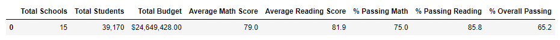
  * After Removing THS 9th Grade Scores:  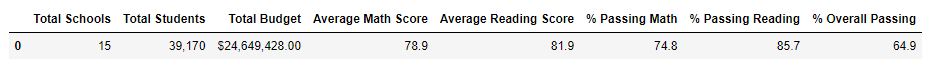
  * Upon review of changes to district summaries, the average math scores decreased by .1%, reading average scores remained the same, percent of students passing math decreased by .2%, passing reading decreased by .1%, and the percentage of overall passing students decreased by .3%.  Removing THS 9th graders' scores has a seemingly minor impact on score averages and passing percentages for the district as a whole.

***

* School Summary Impact
  * Before Removing THS 9th Grade Scores:  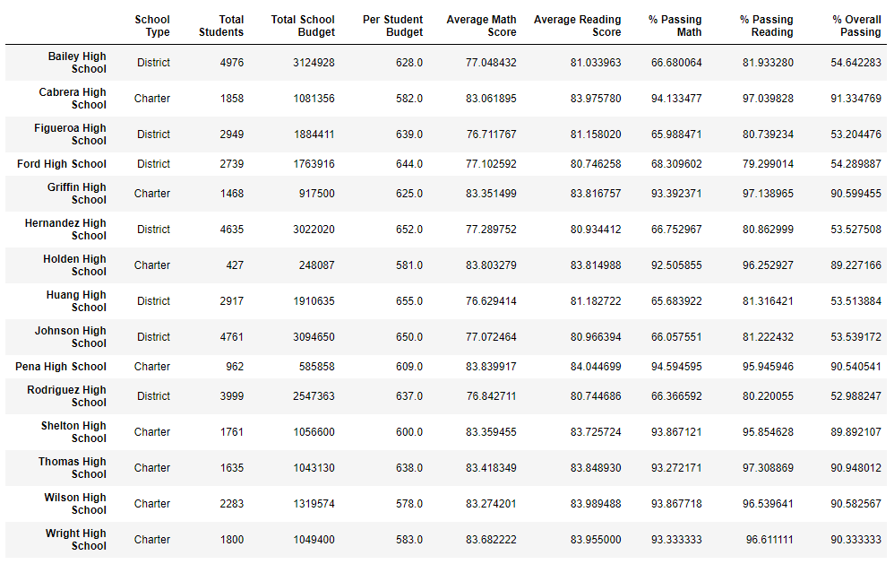
  * After Removing THS 9th Grade Scores:  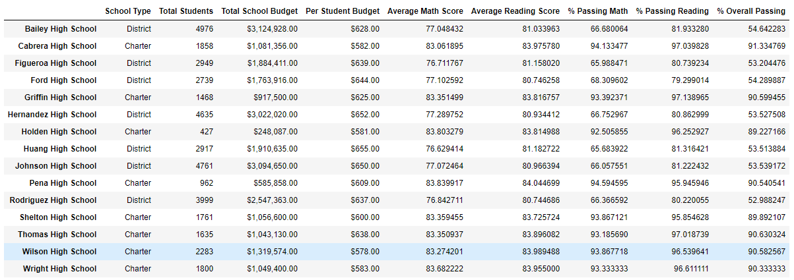
  * Of course, removing the dishonest THS 9th grade scores from the data did not have an impact on any high school but THS.  Removing these scores had an impact on the THS averages and passing rates.  Average math scores decreased by .07%, average reading scores increased by .05%, percent of students passing math decreased by .09, percent passing math in THS dcecreased by .29%, and overall passing students decreased by .32%.  Again, removing the scores did not appear to have a significant impact on average school scores and average passing rate at THS.

***

* Impact on THS Performance (Relative to Other Schools)
  * Top 5 Schools Before Removing THS 9th Grade Scores:  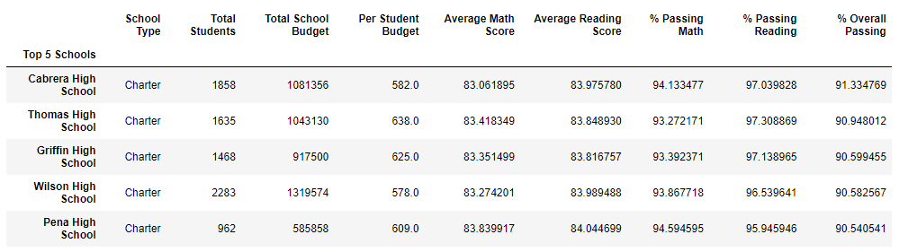
  * Top 5 After Removing THS 9th Grade Scores:  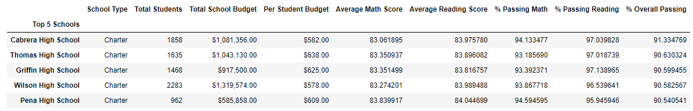
  * Relative to the other schools, while the values for THS overall did change, the changes were not significant enough for THS to lose its standing as the #2 school in the disctict.

***

* Additional Impact Analysis:
  * Math Scores (Before Removing THS 9th Grade Scores):  
  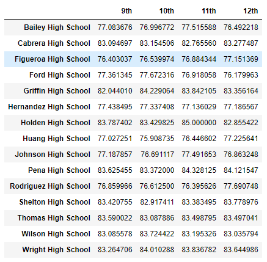
  * Math Scores (After Removing THS 9th Grade Scores):  
  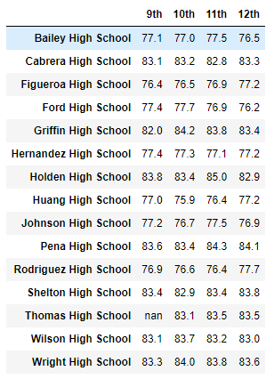
  * Reading Scores (Before Removing THS 9th Grade Scores):  
  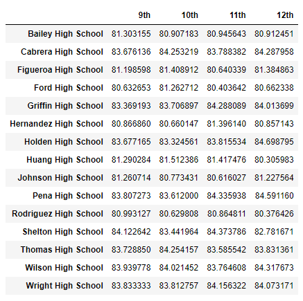
  * Reading Scores (After Removing THS 9th Grade Scores):  
  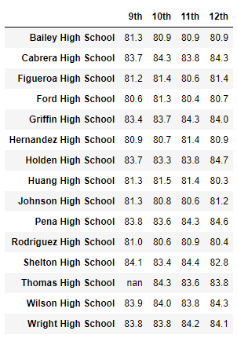
  * With the obvious exception of having NaN values for the 9th grade scores, removing the scores had no impact on the analysis; other schools and grades' average scores remained the same.

***

   * Scores by school spending
     * 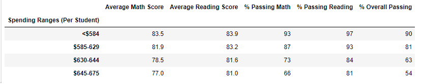
     * 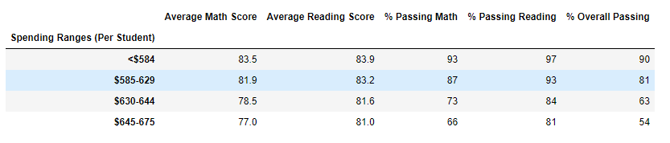
     * There was no significant impact (may be measurable in tenths or hundredths of a percent).

***

   * Scores by school size
     * 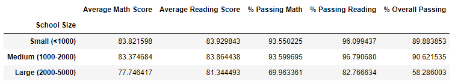
     * 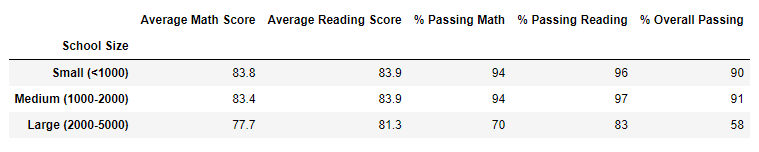
     * There was no significant impact (may be measurable in tenths or hundredths of a percent).

***

  * Scores by school type
    * 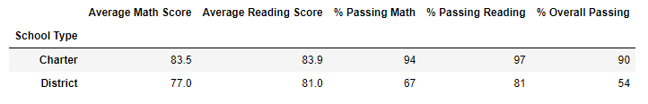
    * 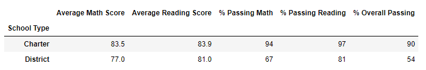
    * There was no significant impact (may be measurable in tenths or hundredths of a percent).

## School District Analysis Summary
Upon removal of the dishonest 9th grade scores from THS, there was minimal impact on many metrics by school and for the entire district.  Due to the size of THS' 9th grade class (less than 10% of the total population) and the fact that scores didn't vary greatly from the rest of the school's scores, are both factors contributing to the relatively unchanged results and analysis.

Across all analyzed metrics, it is clear that spending, 
